#$K$-近邻算法（$K-nearest neighbor$）
---
- W:k-近邻算法笔记
- A:LJH
- T:2018-6-12 23:22:25
- V:1.0  初稿
- V:1.1  添加kdtree和算法运用
- v:1.2  添加k-nearest neighbor的总结

---
<!-- TOC depthFrom:1 depthTo:6 withLinks:1 updateOnSave:1 orderedList:0 -->

- [$K$-近邻算法（$K-nearest neighbor$）](#k-近邻算法k-nearest-neighbor)
- [一.k-近邻算法](#一k-近邻算法)
	- [算法概述](#算法概述)
	- [算法思想改进和优化](#算法思想改进和优化)
		- [①提高算法效率](#提高算法效率)
			- [训练阶段](#训练阶段)
				- [减小计算范围，和计算复杂度](#减小计算范围和计算复杂度)
					- [一种改进的k-近邻算法,结合消极和积极的算法](#一种改进的k-近邻算法结合消极和积极的算法)
				- [构建$KDTree，NBTree$等树结构，使得分类时，快速查找到相关的邻居点](#构建kdtreenbtree等树结构使得分类时快速查找到相关的邻居点)
					- [kd树和最近邻居搜索](#kd树和最近邻居搜索)
			- [去除无用的数据](#去除无用的数据)
			- [分类阶段](#分类阶段)
		- [②提高算法的精度](#提高算法的精度)
			- [训练阶段](#训练阶段)
				- [降低维度](#降低维度)
			- [分类阶段](#分类阶段)
				- [距离的选择](#距离的选择)
				- [k值的选取](#k值的选取)
				- [改进投票机制](#改进投票机制)
					- [距离加权的投票](#距离加权的投票)
- [二、算法改进实现目标](#二算法改进实现目标)
	- [构建KDTree，高纬空间快速定位邻居](#构建kdtree高纬空间快速定位邻居)
- [三、实例](#三实例)
	- [改进约会网站](#改进约会网站)
	- [手写识别系统](#手写识别系统)
- [四、总结：](#四总结)
	- [knn运用实例](#knn运用实例)
	- [knn运用实例](#knn运用实例)
	- [knn改进思路和方法](#knn改进思路和方法)
	- [knn运用过程](#knn运用过程)
	- [knn运用的必须条件](#knn运用的必须条件)
	- [knn可能运用的场景](#knn可能运用的场景)
- [附录：文献或网站参考](#附录文献或网站参考)

<!-- /TOC -->

---
#一.k-近邻算法
##算法概述
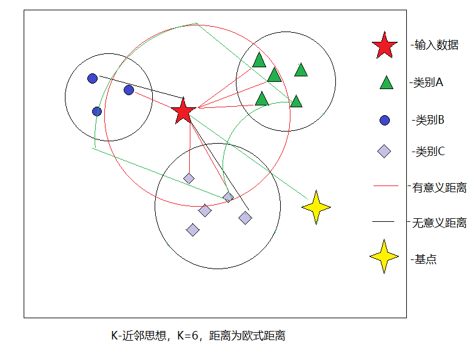

图1:k-近邻展示图

- 存在一个样本数据集合,如上图1中的的除了红色五角星$Star$的所有的点，称作训练数据集，每个数据都有标签，如类别$A$，类别$B$，类别$C$。
- 输入没有标签的数据红色五角星$Star$，将新数据与训练数据集合对应的特征进行比较，然后提取出k个最相似数据（近邻）的分类标签，如图中红色圈圈圈起来的部分就是k近邻范围
- 然后投票k个邻居点中类别最多的绿色三角形类别$A$作为五角星$Star$的类别。

##算法思想改进和优化
###①提高算法效率
改进思想：
- k-近邻最大的消耗原因是因为它是一个消极的算法，所有的计算都在分类阶段进行计算。
- 所以改进的方案有两个入口，一个是训练阶段，一个是分类阶段

####训练阶段
#####减小计算范围，和计算复杂度
######一种改进的k-近邻算法,结合消极和积极的算法
- 思路和思想
- - 由改进思想可得，假如我们能在训练阶段就把所有的数据的相对位置计算出来，然后输入的数据再与相对基点进行比较计算，一次计算，多次使用，且计算的范围大大减小了。
- - 如图1中，在训练阶段，计算所有类别的数据与黄色的四角星基点的距离，并排序获得一个所有数据相对基点的距离的有序列表。
- - 输入数据，计算红色五角星$Star$与黄色四角基点$Sink$的距离D，并从有序列表中取 $[D-h,D+h]$ 的数组，可从图中看出是绿色弧面包含的区域，计算区域内数组与红色五角星的距离，并取出$K$个最近的点，并投票选出最近邻的点。根据作者的论文，相对传统的k近邻效率上提高了近80%。
- 缺点
- - 无法自动设置$d$值影响精度
- - - 从图中可以看出弧形区域并不能包含所有可能是最近邻的点，导致算法存在了一定的误差，这个算法的d的选择对于此改进算法的性能影响非常大，如果$d$小了，那么包含的数据，很有可能非常少，这样子就会到来精度的缺失，非常大又会导致过多的计算，导致改进变得毫无意义。
- - 计算无用的数据点带来了性能的消耗。
- - - 同时，由于距离基点 $[D-h,D+h]$ 中的数据点，有大部分可能是无用的，就如上图红色五角星$Star$，实际只需要绿色圆弧圈起来的区域，但是却会计算整个圆环区域的所有点，实际多余的数据计算还是非常严重，当然这对于最基础的 $knn$ 来说，还是优化了不少，至少是有了一个方向。

#####构建$KDTree，NBTree$等树结构，使得分类时，快速查找到相关的邻居点
######kd树和最近邻居搜索
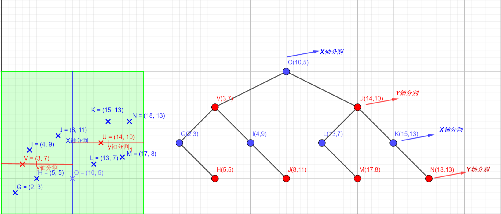

图2:kdtree树的划分和创建图

- 如图2,$kdtree$的含义，$k-dimensional$指的是有$k$个维度划分的树，它的出现主要是为了避免在数据量非常大时，能快速找到$k$近邻。
- 原始$knn$寻找的时间复杂度为$O(n)$,当数据量非常大时，将十分耗时，$kdtree$由于对数据进行了分割，只需要$O(ln2(n))$,可以减少非常多的比较操作。1000,000的数据，意味只要20次的查找及可以找到
- 如何构建一个平衡tree，就是先对数据进行排序后，从第一个维度的中值开始切分，然后下一个维度继续切分。重复操作，直到没有数据。
- 如何保证$k$近邻，可以用一个优先队列存储，当有更好的就替换到队列里的一个。
- 缺点：
- - 当维度较高时，相交的 $cell$ 将成指数增长，故 $kd-tree$ 应用于高度维度数据集时，性能将急剧下降。

####去除无用的数据
如果能确定某些数据是无用的，那么即可去除对应的数据

####分类阶段
无

###②提高算法的精度
####训练阶段
#####降低维度
- 为什么要降低维度？
- - 高维空间通常都极为稀疏，这意味着点与点之间彼此远离，点之间的距离携带的信息极少。
- - 因为高维空间有效的维度可能远小于数据的维度，在距离计算的时候，一些不相关的特征可能会将相关特征的信息淹没，所以在距离计算的时候，可以执行特征选择来降低维度是一种可取的策略。
- - 高纬度容易发生维度灾难
- 维度灾难的发生原因？
- - 随着维度的增长，数据变得越来越稀疏
- - 同时依赖于一条规则：训练数据在内接圆内比在内接圆外更容易划分,如下图：假设维度为d，半径为0.5 内接球的体积的计算公式为：由于公式可得，内接球的体积会越来越趋近于0，导致分类的精确度降低。如图（图来自网络）

\[ V(d) = \frac{\pi^{d/2}}{F(\frac{d}{2} + 1)*0.5^d} \]
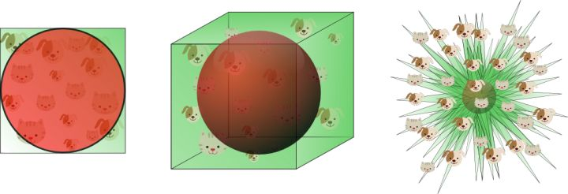

图3:随着维度的增长，红色圆形区域的体积占整体体积的比例逐渐降低，最终会缩为一个点，所以随着维度的增长，训练数据将越来越难划分，如果数据量不足够大的话，将很难得到好的划分

- 维度灾难如何避免？
- - 提供足够的数据，数据点至少要能覆盖20%的特征空间，假设一维空间有10个特征可能，那么至少要2个数据点，才能有效分类，那么2维度就是10*10=100的特征可能，那么至少要20个数据点才能有效分类，依次类推，当维度的增长时，数据点也需要呈现指数级的增长。
- - 选择正确的维度：
- - - 非线性决策边界的分类器（例如神经网络、KNN分类器、决策树等）分类效果好但是泛化能力差且容易发生过拟合。因此，当使用这些分类器的时候，维度不能太高。
- - - 如果使用泛化能力好的分类器（例如贝叶斯分类器、线性分类器），可以使用更多的特征，因为分类器模型并不复杂。
- - 降低维度：
- - - 降低维度，实际就是减少特征数量，可以凭着经验来求最佳的特征数量，也可以用启发式算法来获得最佳的特征数量，也可以用PCA或者别的比较著名的方法来求。

####分类阶段
#####距离的选择
- 定义：设实例空间为H，该空间中的一个距离函数可定义为隐射$D：HXH->R$,则对 任意$x,y,z$有：
- - 1.正定性，$D(x,y)>0$，当且仅当$x=y$时$D(x,y)=0$
- - 2.对称性$D(x,y)=D(y,x)$
- - 3.三角不等式 $D(x,z)>=D(x,y)+D(y,z)$

- 距离主要有以下几种：
- - 欧式距离(Euclidean distance),即2范数闵科夫斯基距离：
  \[D_2(x,y) = (\sum_{i=1}^n|x_i - y_i|^2)^{\frac{1}{2}} = \sqrt{\sum_{i=1}^n|x_i - y_i|^2}\]

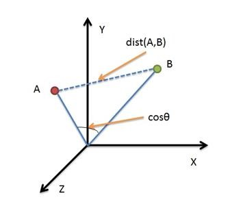

图4:欧式距离的示意图

- - - 选择要求：计算是基于各维度特征的绝对数值，所以欧氏度量需要保证各维度指标在相同的刻度级别，比如对身高（cm）和体重（kg）两个单位不同的指标使用欧式距离可能使结果失效。

- - 曼哈顿距离也称作街区距离，为1范数闵科夫斯基距离：
  \[D_1(x,y) = (\sum_{i=1}^n|x_i - y_i|^1)^{\frac{1}{1}} = \sum_{i=1}^n|x_i - y_i|\]

  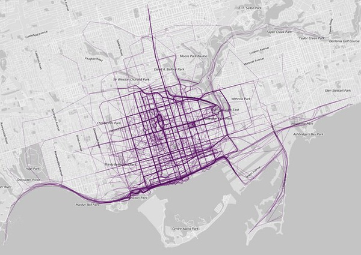

  
图5:曼哈顿距离的示意图

- - 切比雪夫距离，为无限范数闵科夫斯基距离：
  \[D_{\infty}(x,y) = \max_{i}|x_i - y_i|\]
  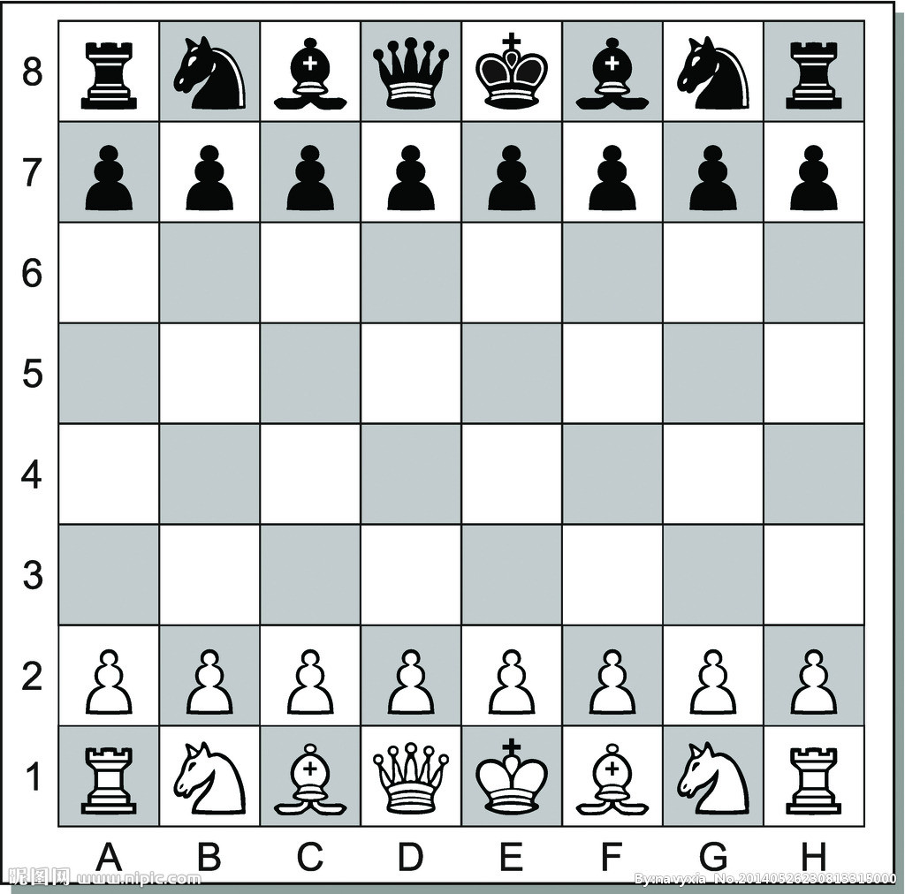
  
图6:切比雪夫距离距离的示意图

- - - 切比雪夫距离（Chebyshev distance）或是L∞度量，是向量空间中的一种度量，二个点之间的距离定义是其各坐标数值差绝对值的最大值。

- - 汉明距离
- - - 两个等长字符串之间的汉明距离（英语：Hamming distance）是两个字符串对应位置的不同字符的个数。换句话说，它就是将一个字符串变换成另外一个字符串所需要替换的字符个数。
- - - 汉明重量，字符串中非0的个数，也就是二进制中1的个数
- - - 如：
- - - - 1011101与1001001之间的汉明距离是2。
- - - - 2143896与2233796之间的汉明距离是3。
- - - - "toned"与"roses"之间的汉明距离是3。

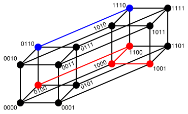

  
图7:汉明距离的示意图

- - 莱文斯坦距离
- - - 莱文斯坦距离，又称Levenshtein距离，是编辑距离的一种。指两个字串之间，由一个转成另一个所需的最少编辑操作次数。允许的编辑操作包括将一个字符替换成另一个字符，插入一个字符，删除一个字符。
- - - 动态规划一般用来作为解决这个问题的手段之一
- - - 如：例如将kitten一字转成sitting：
- - - - sitten （k→s）
- - - - sittin （e→i）
- - - - sitting （→g）

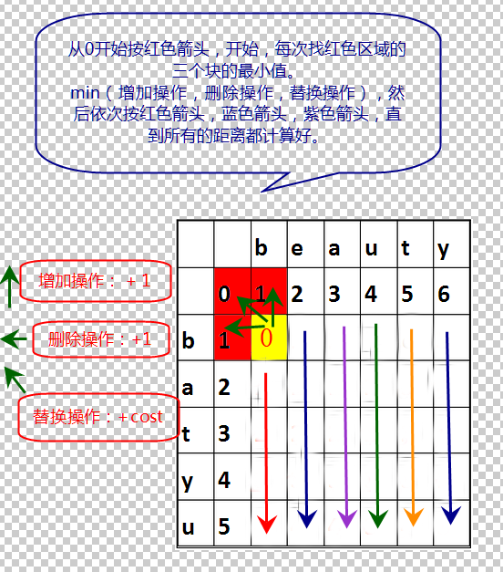
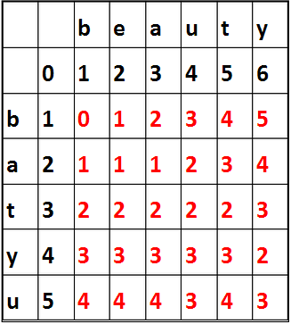

  
图8:莱文斯坦距离的计算示意图

- 马氏距离
- - 马哈拉诺比斯距离是由印度统计学家马哈拉诺比斯 (英语)提出的，表示数据的协方差距离。
- - - 它是一种有效的计算两个未知样本集的相似度的方法。
- - - 与欧氏距离不同的是它考虑到各种特性之间的联系
- - - 样本协方差：
- - - - \[cov(x,y) = \frac{1}{n}\sum_{i=1}^n(x_i-\overline{x})(y_i - \overline{y})\]
- - - - 显然，当x与y同时增大，或者同时减小时，二者的协方差才会为正
- - - - 反之，如果协方差为负，二者反向变动

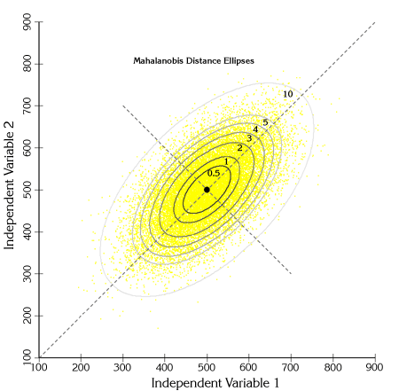

  
图9:马氏距离示意图

#####k值的选取

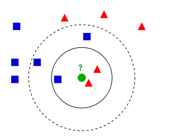

  
图10:k值的选取示意图

从图中可得：
- K值的减小意味着模型变得复杂，容易发生过拟合
- K值增大意味着模型变得简单
- 通常，K值一般取一个较小的数值，然后使用交叉验证法来选取最优的K值

#####改进投票机制
- 在投票中，单纯的用分类最多的类别来作为选择策略，存在一定误差
- 如图1中蓝色的类别$B$的点距离五角星$Star$最近，但是最终却会根据有3个三角形的类$A$决定了输入数据为类$A$，即使蓝色的点距离五角星$Star$最近，所以改进投票机制，主要有距离加权......
######距离加权的投票
- 如改进思想可得，主要的思路就是蓝色点距离那么近，就应该获得更多的权重，大致如此.
- 这样即使k设置的过大，过小，都可以获得一个距离最近的类别，而不会因为k中的样本数据不足，导致了分类的误差。
- 方法：
- - 加权knn可以在k个值中求距离的倒数（加一个常数），也可以使用高斯距离来求加权。
- -  \[distance = \frac{1}{(distance + cont)}\]

---
#二、算法改进实现目标
##构建KDTree，高纬空间快速定位邻居

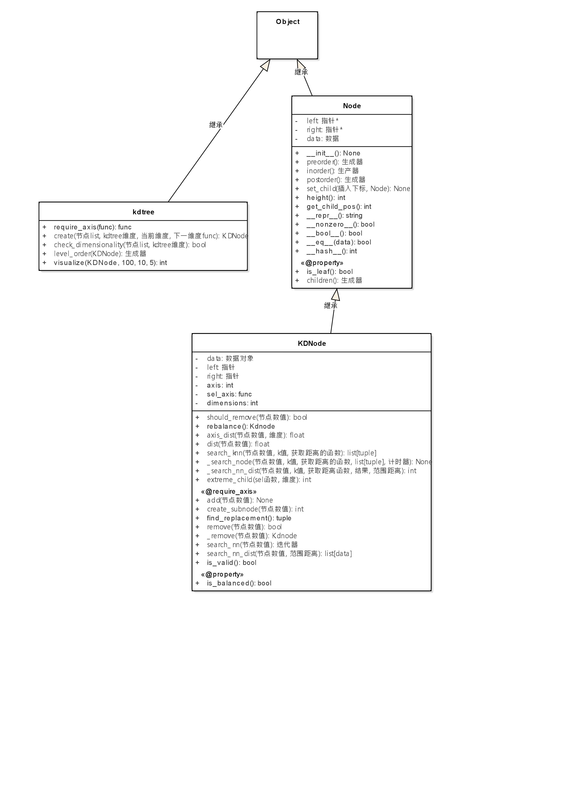

图11:UML类图

---
#三、实例
##改进约会网站

- 元素数据如下表

飞行公里  | 一周冰淇淋的公升数 | 一天的游戏比例  | 喜好程度
| ----- | --------- | -------- | ---------- |
40920 | 8.326976  | 0.953952 | largeDoses |
 14488 | 7.153469  | 1.673904 | smallDoses |
 26052 | 1.441871  | 0.805124 | didntLike  |
 75136 | 13.147394 | 0.428964 | didntLike  |
 38344 | 1.669788  | 0.134296 | didntLike  |
 72993 | 10.141740 | 1.032955 | didntLike  |
 35948 | 6.830792  | 1.213192 | largeDoses |
 42666 | 13.276369 | 0.543880 | largeDoses |

- 元素分布图

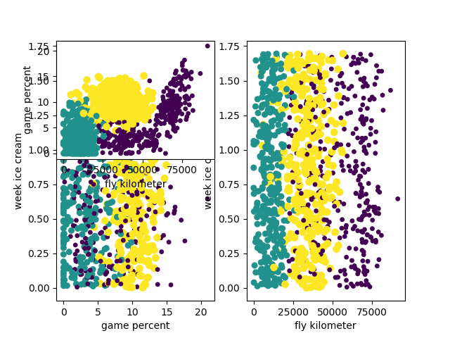

图12:元素分布图

- 核心思想：
- - 一个用户预先对较多的用户评价出，非常喜欢，一点点喜欢，不喜欢三个类别，根据这些数据。我们在> 判断当前输入是用户喜欢还是不喜欢，就是找到最接近这个数据的$k$个数据，并从中选择最多归属的类别 为输出。
- - 改进，由于计算所有的数据，将会非常的慢，所以采用Kdtree存储数据结构，只要找到找到最近的k个邻> 居就可以了。

##手写识别系统
- 数据结构如下：
- 00000000000001100000000000000000
- 00000000000011111100000000000000
- 00000000000111111111000000000000
- 00000000011111111111000000000000
- 00000001111111111111100000000000
- 00000000111111100011110000000000
- 00000001111110000001110000000000
- 00000001111110000001110000000000
- 00000011111100000001110000000000
- 00000011111100000001111000000000
- 00000011111100000000011100000000
- 00000011111100000000011100000000
- 00000011111000000000001110000000
- 00000011111000000000001110000000
- 00000001111100000000000111000000
- 00000001111100000000000111000000
- 00000001111100000000000111000000
- 00000011111000000000000111000000
- 00000011111000000000000111000000
- 00000000111100000000000011100000
- 00000000111100000000000111100000
- 00000000111100000000000111100000
- 00000000111100000000001111100000
- 00000000011110000000000111110000
- 00000000011111000000001111100000
- 00000000011111000000011111100000
- 00000000011111000000111111000000
- 00000000011111100011111111000000
- 00000000000111111111111110000000
- 00000000000111111111111100000000
- 00000000000011111111110000000000
- 00000000000000111110000000000000

> - 核心思想：
- - 把数据矩阵变成向量，然后和约会网站类似的，根据输入的数据，判断最近的k个数据，并选出类别最多的那个，就是预测的数据。

---
#四、总结：
##knn运用实例
<table>
   <tr>
      <td>类别</td>
      <td>实例</td>
      <td>问题简述</td>
      <td>tips</td>
   </tr>
   <td rowspan =3>k-近邻算法</td>
   <tr>
      <td>改进约会网站</td>
      <td>给出飞行公里数，一周冰淇淋公升数，每天的游戏比例，问喜欢这个人吗？</td>
      <td>效果，大部分取决于训练数据的正确性。</td>
   </tr>
   <tr>
      <td>手写识别系统</td>
      <td>输入一个手写的图片，问这个数字是多少？</td>
      <td>效果，取决于训练数据。</td>
   </tr>
</table>

##knn运用实例
步骤  |  方法
--|--
 收集数据 |  可以使用任意方法
 准备数据 |  数值型
 分析数据 |  有大量特征时，画散点图
 训练算法 |  无，可以根据数据，创建kdtree，方便测试时获取数据
 测试算法 |  使用交叉留存验证算法的错误率
 使用算法 |  改进约会网站，手写识别系统

##knn改进思路和方法
- 为什么要进行改进算法的效率？
- - k-近邻最大的消耗原因是因为它是一个消极的算法，所有的计算都在分类阶段进行计算。每次都需要全新的计算目标点与数据集合中的所有点的距离，然后进行排序。那么对所有点的距离的算法就为 $O(n)$,然后进行排序，如果利用快速排序的话，那么就是 $O(n + nlgn)$，消耗对于需要大量验证有点过大。

- 为什么要改进算法的精确度？
- - 如果数据的维度过大，数据点之间的距离携带的信息就会极少，容易发生维度灾难，固定的 $k$值，在一定程度上可能导致过拟合，或者有效信息元素过少带来的错误判断。所以需要在精确度上经过一些方法来提高。

<table border=0 cellpadding=0 cellspacing=0 width=1301 style='border-collapse:
 collapse;table-layout:fixed;width:976pt'>
 <col width=158 style='mso-width-source:userset;mso-width-alt:5056;width:119pt'>
 <col width=72 style='width:54pt'>
 <col width=237 style='mso-width-source:userset;mso-width-alt:7584;width:178pt'>
 <col width=315 span=2 style='mso-width-source:userset;mso-width-alt:10080;
 width:236pt'>
 <col width=72 style='width:54pt'>
 <col width=132 style='mso-width-source:userset;mso-width-alt:4224;width:99pt'>
 <tr height=18 style='height:13.5pt'>
  <td height=18 width=158 style='height:13.5pt;width:119pt'>类别</td>
  <td width=72 style='width:54pt'>阶段</td>
  <td width=237 style='width:178pt'>方法</td>
  <td width=315 style='width:236pt'>实例</td>
  <td width=315 style='width:236pt'>实例描述</td>
  <td width=72 style='width:54pt'>优点</td>
  <td width=132 style='width:99pt'>缺点</td>
 </tr>
 <tr height=324 style='mso-height-source:userset;height:243.0pt'>
  <td rowspan=4 height=504 style='height:378.0pt'>提高算法的效率</td>
  <td rowspan=3 class=xl6529619>训练阶段</td>
  <td rowspan=2 class=xl6529619>减小计算范围，和计算复杂度</td>
  <td >一种改进的k-近邻算法,结合消极和积极的算法</td>
  <td width=315 style='width:236pt'>1、在训练阶段，随机找到一个基点，并计算所有数据与基点的相对距离。2、需测试的数据计算与这个基点的相对距离，从所有数据与基点的相对距离中，找出对应范围的数组，并只对这些数组计算距离，剩下部分与普通knn一致。</td>
  <td width=72 style='width:54pt'>能快速的找到可能 
    的相邻元素</td>
  <td width=132 style='width:99pt'>1、无法自动选取k值，导致对结果影响挺大 
    2、数组计算的范围为一个圆弧圈，实际上，目标数据只需要一段的数据即可，有计算多余数据的问题 
    </td>
 </tr>
 <tr height=126 style='height:94.5pt'>
  <td height=126 width=315 style='height:94.5pt;width:236pt'>构建KDTree，NBTree等树结构，使得分类时，快速查找到相关的邻居点</td>
  <td width=315 style='width:236pt'>1、kdtree的含义，k-dimensional指的是有k个维度划分的树，它的出现主要是为了避免在数据量非常大时，能快速找到k近邻。2、先对数据进行排序后，选择数据中的一个维度的中值进行切分，然后下一个维度继续取维度的中值进行切分。3、保存最近邻，可用优先队列来保存。4、查找knn的时间为O(lg2n)</td>
  <td width=72 style='width:54pt'>能快速的找到的相邻元素</td>
  <td width=132 style='width:99pt'>当维度较高时，相交的 cell 将成指数增长，故
  kd-tree 应用于高度维度数据集时，性能将急剧下降。</td>
 </tr>
 <tr height=36 style='height:27.0pt'>
  <td height=36  width=237 style='height:27.0pt;width:178pt'>去除无用的数据</td>
  <td width=315 style='width:236pt'>如果能确定某些数据是无用的，那么即可去除 
    对应的数据</td>
  <td ></td>
  <td ></td>
  <td ></td>
 </tr>
 <tr height=18 style='height:13.5pt'>
  <td height=18  width=72 style='height:13.5pt;width:54pt'>分类阶段</td>
  <td ></td>
  <td ></td>
  <td ></td>
  <td ></td>
  <td ></td>
 </tr>
 <tr height=126 style='height:94.5pt'>
  <td rowspan=2 height=252 style='height:189.0pt'>提高算法的精度</td>
  <td width=72 style='width:54pt'>训练阶段</td>
  <td >降低维度</td>
  <td width=315 style='width:236pt'>降低维度</td>
  <td width=315 style='width:236pt'>1、高维空间通常都极为稀疏，这意味着点与点之间彼此远离，点之间的距离携带的信息极少，因为高维空间有效的维度可能远小于数据的维度，2、在距离计算的时候，一些不相关的特征可能会将相关特征的信息淹没，所以在距离计算的时候，可以执行特征选择来降低维度是一种可取的策略。</td>
  <td width=72 style='width:54pt'>能使得距离上携带的信息更有益</td>
  <td ></td>
 </tr>
 <tr height=126 style='height:94.5pt'>
  <td height=126 style='height:94.5pt'>分类阶段</td>
  <td >改进投票机制</td>
  <td width=315 style='width:236pt'>距离加权的投票</td>
  <td width=315 style='width:236pt'>1、k值的减小，意味着容易发生过拟合，k值过大，意味着模型编的简单，变成非分类事件，我们要在选取的k值中保证距离越近的点获取的权重越高，这样发生错误的概率就得到了降低。 
    2、加权knn一般，可以用距离加一个常数的倒数来做，也可以用高斯距离来求加权</td>
  <td width=72 style='width:54pt'>使得距离越近，获得的权重越高，精度越高</td>
  <td width=132 style='width:99pt'>常数不确定</td>
 </tr>
 </tr>
</table>

##knn运用过程
- 1、选择或者获取数据
- 2、对数据进行清洗，并创建kdtree存储数据结构
- 3、从测试数据中，交叉留存计算算法的错误率
- 4、根据用户输入，运用算法
##knn运用的必须条件
必须的条件  | 为什么  | ？
--|---|--
数据的类型必须是数值型或者标称型，或者可以转化成对应的数据类型  | 因为knn是基于距离的一种算法，那么就一定要保证距离是可计算的，也就是必须是数值型或者标称型   |
 knn算法的正确性，依赖于维度和数据量 |维度过大，可能导致数据的稀疏，距离携带的信息就会极小，测试数据量小，就可能带来无法有效地分类。   |
数据间的距离有实际意义   | 一般来说距离代表着数据之间的相似度，越近，说明越相近，如果数据的距离没有意义，那么就不适用knn|
待推荐的数据的特征一定是有意义的，且固定的。   | 因为最终要根据原始数据的特征与测试数据的特征的相似度进行比较。才进行推荐  | 所以基本排除判断类，更多可能的是实体类，如推荐音乐（本身具有固定的特征和特性，不会改变，也不会有判断歧义），购物推荐等实体类

##knn可能运用的场景
 可能运用的场景  |  原因
--|--
 音乐（电影）推荐算法 | 音乐本身带有大量的标签数据，这些数据可以转化为类别数值，根据玩家选择，和爱好的音乐，可以计算与标准数据的距离，判断玩家的爱好排序，并智能进行推荐给玩家喜欢的音乐，可以和朴素贝叶斯和关联推荐一起考虑做个音乐推荐播放器？类似网易那种很棒的推荐音乐。（其中可以加入人工推荐库，随机选择一个高质量的品种推荐，同时选择（k*）算法，杂交出下一个音乐，保持一定的随机性。或者用蚁群算法，模拟玩家的兴趣爱好走向，保持一定的随机性，避免因为频繁的听一种类型的音乐，导致了信息素都停留在了这条线内。） 1、knn筛选玩家爱好顺序的排序 2、然后经过朴素贝叶斯根据玩家的习惯，推荐10~20首歌曲 3、利用（k*）或者蚂蚁算法，来保证用户的推荐不会走向一个死胡同里  |
 涉及可以计算距离的地方都可以使用 | 实际就是计算相似度来处理的。
 购物行为预测  | 在玩家购物时，获取这些属性特征，购物时间，购物数量，购物类别，从把数据加入到购物栏，到支付下单使用的时间，购物金额等数据，就可以推荐广告给用户了。可以计算出，玩家最喜欢，下单最快，金额中等的那种物品，同时购物时间要比较新的。

---
#附录：文献或网站参考
- 在[0]中，作者，通过分析k近邻算法耗时长最大的问题在于它是一个消极的算法，计算都在分类阶段进行，他提出了结合消极和积极的算法，通过在训练数据阶段，
  选取一个基点o，并计算所有的实例对于o点的距离，这样子，并进行排序，这样子带测试实例x，和以后的所有类别都可以使用这个数据，在数据量越大的情况下，
  节省的时间越多，待测数据x计算与o基点的距离，然后筛选距离k的区间，然后计算x与区间中的所有点的距离。并找出距离最近的数据作为分类。这个d和o点选取
  是这个论文所没有讨论出如何选取的。同时也提及了3类改进knn算法的思路：1、更合适的距离 2、更合适的k值 3、更加精确的概率，代替投票机制，这些主要是用于提高
  分类精度的，提高效率有KDTree，NBTree，是通过构造树，但是无法避免树学习过程的小分离问题，思路很清晰，但是由于预计算，所以必须在训练阶段确定一个全局相似,缺少更丰富的元素。
- 在[1]中，作者通过概述k近邻的发展，如何提高精度，如何降低复杂度，主要有3个路线，一个是降低维度，就是降低计算的复杂度，要保证维度足够代表说有的空间。
  第二个：是预结构，通过构建，相似邻居的树或者结构，更快的搜索树；第三个是：去除无用的数据。概述性非常强，但是缺少自己核心的思路。
- 在[2]中，作者提出了一种k近邻算法的运用.
- 在[3]中，作者实现了KD-tree运用在knn算法的。
- 在[4]中，作者解释了kdtree的d是维度的意思，k是最近邻的意思。并讨论了kdtree的效率问题，与及如何分割数据点。如何保持kd树的平衡。创建一个优先队列，来保存最小的k个值。
- 在[5]中，详细解释了k-d的术语和核心思想和伪代码。
- 在[6]中，作者详细翻译了The Curse of Dimensionality in Classification中的文章，说明了维度灾难和如何避免维度灾难：产生：当维度急剧增长时，可用数据变得很稀疏，对于依赖统计分析的算法都是一个问题。因为大部分的数据都会在边角处，不好分类，同时
  稀疏的数据分布导致了高维的数据量要以指数递增才能保证它的正确性。如何避免灾难。
    在[7]中，作者描述了，加权knn的的意义，使得k值的选取不是那么的重要，避免了不合适的k值引起的误差，对k个值进行距离权重的加权（加常数），最简单的思想是距离的倒数，文中使用高斯函数来加权。
-----------------------------------------
> - [0]一种改进的k近邻算法
>   http://read.pudn.com/downloads191/doc/900685/%E4%B8%80%E7%A7%8D%E6%8F%90%E9%AB%98K_%E8%BF%91%E9%82%BB%E7%AE%97%E6%B3%95%E6%95%88%E7%8E%87%E7%9A%84%E6%96%B0%E7%AE%97%E6%B3%95.pdf
> - [1]基于K近邻的分类算法研究
>   http://xueshu.baidu.com/s?wd=paperuri%3A%286bc715711339aa21815fa7cedf80ef62%29&filter=sc_long_sign&tn=SE_xueshusource_2kduw22v&sc_vurl=http%3A%2F%2Fwenku.baidu.com%2Fview%2F76ca015ef78a6529647d5383.html&ie=utf-8&sc_us=6349279941802141378
> - [2]基于K近邻的新话题热度预测算法
>   http://www.cqvip.com/read/read.aspx?id=42784438
> - [3]K-D TREE算法原理及实现
>   https://leileiluoluo.com/posts/kdtree-algorithm-and-implementation.html
> - [4]kd树和最近邻居搜索
>   https://gopalcdas.com/2017/05/24/construction-of-k-d-tree-and-using-it-for-nearest-neighbour-search/
> - [5]K-dimensional tree
>   http://jiehust.github.io/data%20structure/2015/02/08/Kd-tree/
> - [6]机器学习中的维度灾难
>   https://zhuanlan.zhihu.com/p/26945814
> - [7]k最邻近算法——加权kNN
>   https://www.cnblogs.com/bigmonkey/p/7387943.html
