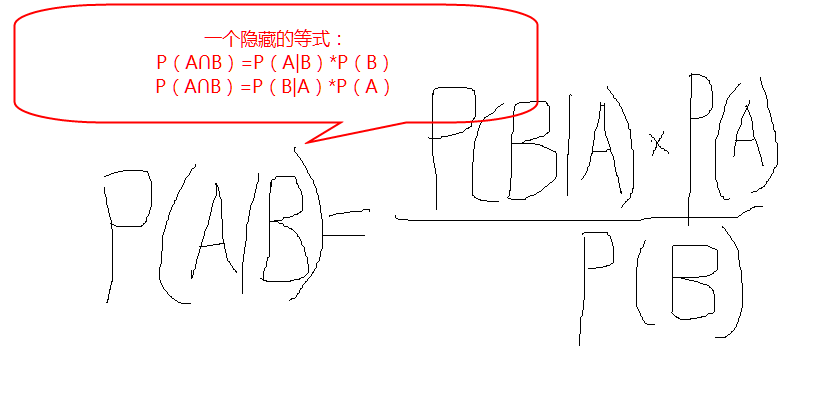
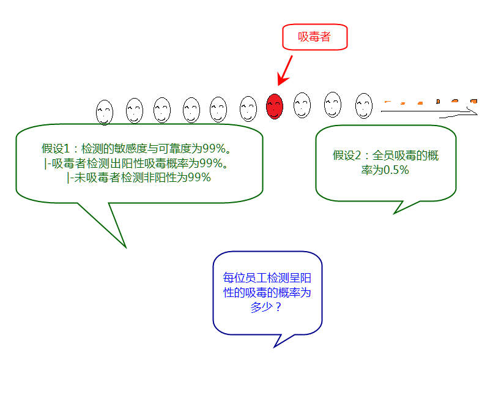
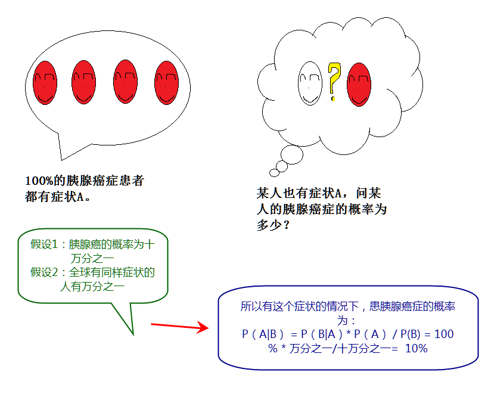
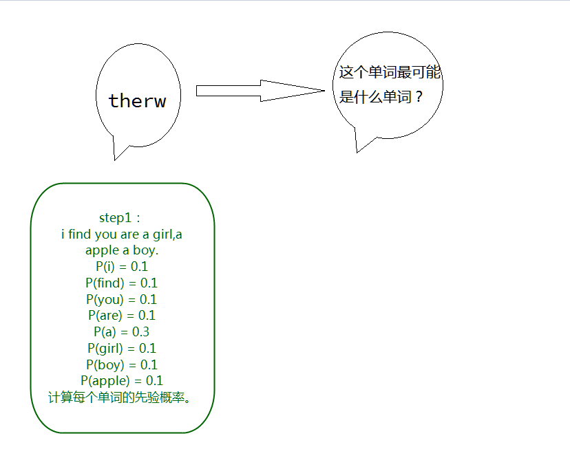
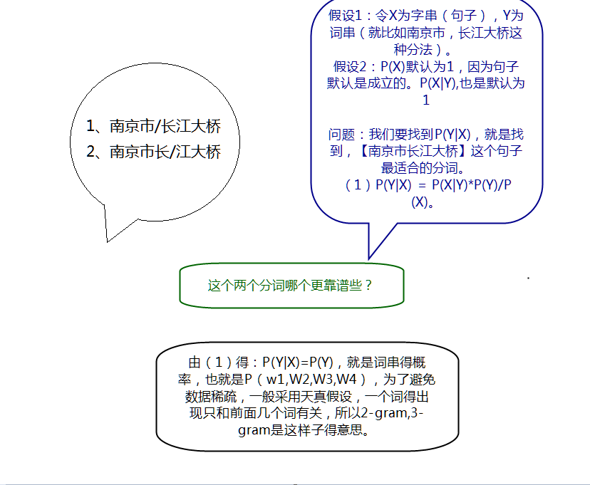
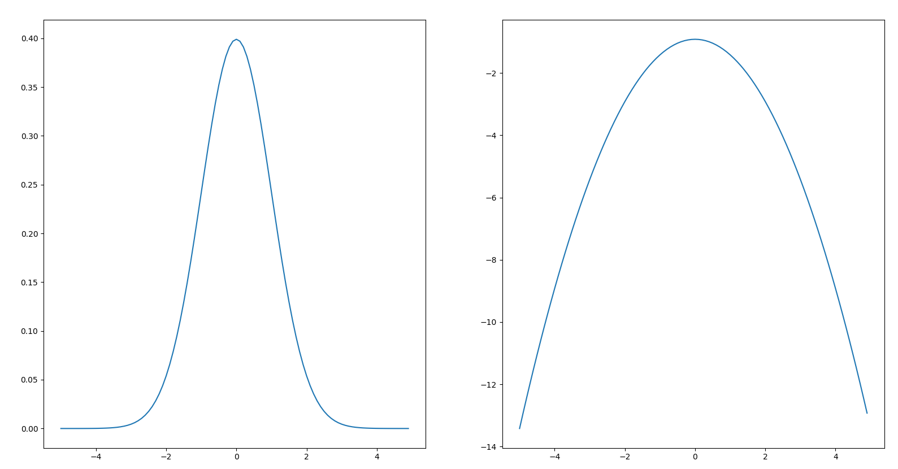
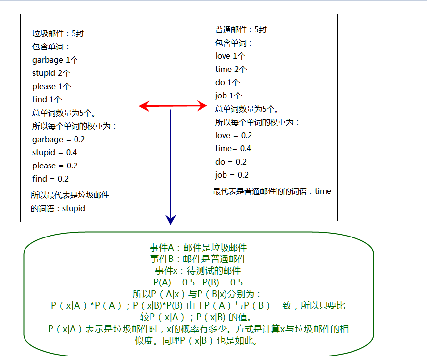

#朴素贝叶斯（Naive Bayes)
---
- W:朴素贝叶斯笔记
- A:LJH
- T:2018-4-11 21:18:03
- V:1.0  初稿 初步定义格局 2018/4/26 下午3:38:22
- V:1.1  添加挽留玩家分析和恶性商店筛选，推导朴素贝叶斯
- V:2.0  添加朴素贝叶斯的实例和代码实现，并总结 2018-6-8 17:34:28
---
<!-- TOC depthFrom:1 depthTo:6 withLinks:1 updateOnSave:1 orderedList:0 -->

- [朴素贝叶斯（Naive Bayes)](#朴素贝叶斯naive-bayes)
- [一.贝叶斯理论](#一贝叶斯理论)
	- [定则](#定则)
	- [推导](#推导)
	- [范例](#范例)
		- [水果糖例子](#水果糖例子)
		- [吸毒者检测](#吸毒者检测)
		- [胰腺癌检测](#胰腺癌检测)
		- [拼写纠正](#拼写纠正)
		- [中文分词](#中文分词)
		- [是否挽留玩家](#是否挽留玩家)
		- [恶性商店检测](#恶性商店检测)
- [二.朴素贝叶斯](#二朴素贝叶斯)
- [三.范例](#三范例)
	- [筛选论坛污辱言论](#筛选论坛污辱言论)
	- [垃圾邮件分类](#垃圾邮件分类)
	- [rss源分类](#rss源分类)
- [四.代码实例-qqmessage](#四代码实例-qqmessage)
- [五.总结](#五总结)
	- [贝叶斯运用实例](#贝叶斯运用实例)
	- [贝叶斯运用过程](#贝叶斯运用过程)
	- [贝叶斯运用的必须条件](#贝叶斯运用的必须条件)
	- [贝叶斯运用的场景](#贝叶斯运用的场景)
- [Ⅰ.引用或参考](#引用或参考)
- [Ⅱ.附录](#附录)
	- [[1]全概率公式](#1全概率公式)

<!-- /TOC -->
#一.贝叶斯理论

##定则
\[P(A|B)=\frac{P(B|A)*P(A)}{P(B)}\]
名词解析：
- $P(A|B)$ 是已知B发生后A的条件概率，所以B是A的后验概率。
- $P(A)$ 是A的先验概率。
- $P(B|A)$ 是已知A发生后B的条件概率，所以A是B的后验概率。
- $P(B)$ 是B的先验概率。

表述为：
- 后验概率 = (可能性*先验概率)/标准化常量

通常把 $\frac{P(B|A)}{P(B)}$ 称作标准相似度
- 后验概率 = 标准相似度*先验概率

##推导
条件概率定则：
\[方程(1): P(A|B)=\frac{P(A\cap B)}{P(B)}\]
\[方程(2): P(B|A)=\frac{P(A\cap B)}{P(A)}\]
结合方程（1）和方程（2） 得到:
\[方程(3): P(A|B)P(B)=P(A\cap B)=P(B|A)P(A)\]
对方程（3）同时除以 $P(B)$,若 $P(B)$ 非0，可以得到贝叶斯定理：
\[P(A|B)=\frac{P(B|A)*P(A)}{P(B)}\]


解释：
事件A在事件B发生的条件下的概率 = 事件A与事件B同时发生的概率 / 事件B发生的概率

##范例
###水果糖例子
如图：
假设：两个一模一样的碗，一号碗有30颗水果糖和10颗巧克力糖，二号碗有水果糖和巧克力糖各20颗。

问题：现在随机选择一个碗，从中摸出一颗糖，发现是水果糖。请问这颗水果糖来自一号碗的概率有多大？

分析：$P(H1)$ 表示选择1号碗和选择2号碗的概率分别为0.5。E表示水果糖，所以问题转换成，P(H_1|E)在发现是水果糖的情况下，是从1号碗里获取的概率。

\[方程(4):P(H_1|E) = \frac{P(E|H_1)*P(H_1)}{P(E)} \]
由方程（4）得：
\[方程(5):P(H_1|E) = P(H_1)*\frac{P(E|H_1)}{P(E)} \]
由附录[1]全概率公式得：
\[P(E)=P(E|H_1)P(H_1) + P(E|H_2)P(H_2)\]
得：0.75 * 0.5 + 0.5 * 0.5 =0.625
所以
\[P(H_1|E) = 0.5 * \frac{0.75}{0.625} = 0.6\]
所以获取的水果球是在1号碗中获取的概率为0.6，说明是正反馈。取出水果糖之后，H1事件的可能性得到了增强。

###吸毒者检测

分析：
- 假设：“D”为雇员吸毒事件，“N”为雇员不吸毒事件，“+”为检测呈阳性事件
- $P(D)$ = 为雇员吸毒事件，由图中假设2可得0.005
- $P(N)$ = 为雇员不吸毒事件，有 $P(N) = 1- P(D) = 0.995$
- $P(+|D)$ = 吸毒检测为阳性，由图中假设1可得0.99
- $P(+|N)$ = 非吸毒则检测为阳性，由图中假设2可得0.01
- $P(+)$ 员工检测为阳性的事件是，吸毒检测为阳性和非吸毒检测为阳性的集合，由附录[1]全概率公式得： $P(+) = P(+\cap D) + P(+\cap N) = P(+|D)*P(D) + P(+|N)*P(N) = 0.0148$
所以检测是阳性的吸毒者概率为：
\[P(D|+) = \frac{P(+|D)*P(D)}{P(+)} = \frac{0.99*0.005}{0.0148} = 0.3344\]
同理检测是非阳性的非吸毒者的概率为：
\[P(N|(-)) = \frac{P(-|N)*P(N)}{P(-)}=\frac{0.99*0.995}{0.986} = 0.999\]
结论：
即使检测率为99%,但是贝叶斯告诉我们，检测呈阳性，只有33%的概率是吸毒的，不吸毒的概率更大。假阳性高，则检测结果不可靠。

###胰腺癌检测

基于贝叶斯定理：即使100%的胰腺癌症患者都有某症状，而某人有同样的症状，绝对不代表该人有100%的概率得胰腺癌，还需要考虑先验概率，假设胰腺癌的发病率是十万分之一，而全球有同样症状的人有万分之一，则此人得胰腺癌的概率只有十分之一，90%的可能是是假阳性。

###拼写纠正

经典著作《人工智能：现代方法》的作者之一 Peter Norvig 曾经写过一篇介绍如何写一个拼写检查/纠正器的文章。
> 问题：是我们看到用户输入了一个不在字典中的单词，我们需要去猜测：“这个家伙到底真正想输入的单词是什么呢？”
由朴素贝叶斯定定理:
- A事件：我们猜测他想输入的单词
- B事件:实际输入的单词
- $P(A|B)$:我们需要计算用户最想输入的单词。
- $P(B|A)$:猜测的单词是实际输入的单词的概率。
- $P(A)$:猜测的单词的概率（由样本生成）
- $P(B)$:实际输入的单词的概率（由于P(B)无法计算）所以固定为一样

所以计算公式：
\[P(A|B) = \frac{P(B|A)*P(A)}{P(B)} ~= P(B|A)*P(A) \]
- 所以只要求 $P(B|A)*P(A)$ 就可以获得数据了。

###中文分词

如何找到一个句子最好得分词，需要有天真得假设，一个词语得出现只和前后几个词语有关。

###是否挽留玩家


由图中计算未读信息大于5的流失的概率为 $P(A|B)$，由朴素贝模型得：
\[ P(A|B) = \frac{P(B|A)*P(A)}{P(B)} = \frac{0.93*0.3}{0.35} = 0.80\]
实情况并不会像这个例子这么理想化,现实情况中，你可能要找上一堆觉得能够凸显用户流失的行为，然后一一做贝叶斯规则，来测算他们是否能显著识别用户流失。这取决于你对业务的理解程度和直觉的敏锐性。另外，你还需要定义“流失”和“活跃”，还需要定义贝叶斯规则计算的基础样本，这决定了结果的精度。


###恶性商店检测
为了肃清电商平台的恶性商店。
- $P(E)$ 目前商店上的恶性客户的比例为0.2%
- $P(P|E)$  表示恶性商户被M1模型检测为恶性商户的概率。90%
- $P(P|~E)$ 表示非恶性商户被M1模型检测为恶性商户的概率为8%
- 那么P(E|P) 被M1模型判定为恶性商户的概率为：
\[P(E|P)=\frac{P(P|E)P(E)}{P(P)}\]
由附录[1]全概率公式得：
\[P(P) = P(P|E)*P(E) +P(P|~E)*P(~E) = 0.9*0.002 + 0.998*0.08=0.08164\]
所以
\[P(E|P)=\frac{0.9*0.002}{0.08164} = 0.022\]
被M1模型判别为恶性商户，说明这家商户做出恶性行为的概率是一般商户的11倍，那么，就非常有必要用进一步的手段进行检查了。

#二.朴素贝叶斯
朴素贝叶斯的理念非常朴素，就是假设所有的特征属性都是独立的，挑选出概率最大的类别，就是最后的结果。
简单的推导思路：
- 设置预测项目 $x={a_1,a_2,...a_n}有n个特征属性$
- 有类别集合 $C={y_1,y_2,...,y_n}$
- 要预测x属于C中的哪个类别
- 则计算 $P(y_1|x),P(y_2|x),...,P(y_n|x)$的概率
- 如果 $P(y_k|x) = argmax{P(y_1|x),P(y_2|x),...P(y_n|x)}$,则 $x \in y_k$
- 统计各类别下各个特性属性的条件概率估计：$P(a_1|y_1),P(a_2|y_1),...P(a_m|y_1);P(a_1|y_2),P(a_2|y_2),...,P(a_m|y_2);...,P(a_1|y_n),P(a_2|y_n)...P(a_m|y_n)$
- 根据贝叶斯定理，要求$P(y_i|x)$则有公式
\[P(y_i|x)=\frac{P(x|y_i)P(y_i)}{p(x)}\]
- 假设x中的各个特征的属性是独立的，那么 $P(x)$是固定的，那么有：
\[P(y_i|x) = P(x|y_i)P(y_i) = P(a_1|y_i)*P(a_2|y_i)...P(a_m)P(y_i)=P(y_i)argmaxP(a_j|y_i)\]

- 所以在计算 $P(y_i|x)后再计算所有 $P(y_n|x)$,找出最大的 $P(y_k|x)$，则 $x \in y_k$

#三.范例
##筛选论坛污辱言论

采用伯努利朴素贝叶斯模型，在代码中就是词集模型，只检查特征是否出现，不计算特征出现的次数。核心就是：
- 计算侮辱言论中的所有词汇在所有的词汇中出现的比例用来表示这个单词能判断是否是侮辱言论的权重 $\frac{Num_word}{\sum_{k=1}^nk*num}$ ，同样普通言论也是如此。
- 最后测试言论根据权重计算与相应类别的相似度，相似度越高的类别，这是朴素贝叶斯要寻找的类别。
> 在利用python实现时，需要注意几个问题：
> - 分子为0的情况导致的结果为0，设置初始分子为1，初始分母为2
> - 下溢出问题，由于python对非常小的数进行相乘可能或得到不正确的数值，所以采用自然对数函数ln，利用函数的最大值是一致。
> 

##垃圾邮件分类

采用词袋模型，不止看特征是否出现，同时特征出现的数量也会被统计。
核心：
- 计算统计垃圾邮件和普通邮件的所有词汇，并统计垃圾邮件中和普通邮件中的词汇占各自所有的词汇的比例，最后测试邮件，计算与垃圾邮件和普通邮件的相似度，相似度更大的则为所选择。
> 在利用Python实现时，需要注意以下几个问题：
> - 切分文本时，由于只考虑词语，所以不需要考虑是否是大小写，所以统一转换为小写字符，并且由于英文字符有空字符，所以要去除掉空字符
> - 为了更好的测试分类的正确性，采用了交叉留存验证，假设有50封垃圾邮件，50封普通邮件，我们随机用30封普通邮件和30封垃圾邮件进行训练分类，其余的邮件用来测试，反复测试，获得一个平均的算法的错误率。

##rss源分类
由于这个分类和垃圾邮件分类非常相似，除了在数据来源和以下方面有一些区别：
> - 数据来源与rss上
> - 由于rss源数据上，有许多的高频词是无意义的，去除一定的高频词对算法是有所帮助的。
> - 同时发现高频词语基本都是一些停用词语，就是一些人统计出来的无意义的高频词语，对原始数据剔除相关的词语，会对算法带来一定的提交


#四.代码实例-qqmessage
- qqmessage：是根据朴素贝叶斯对qq聊天记录是属于哪个人说话的分类
- 想法：最常用的就是qq，如果qq能识别出是否是对方，是否就能避免此人是否是骗子？我想有一定的合理性，可以提出一个概率，当对方不是本人的概率超过一个阈值的时候，提示用户，这个人可能是骗子。
- 思路：和以上的实例的思路是一致的，只有一些小区别：
- - qq聊天记录，是直接导出来的txt格式的文件，数据要从文本中获取
- - 中文分词比较复杂，所以用jieba库直接切割中文词语了，同时去除了只包含一个词的
- - 使用了中文的停用词，加上由于qq聊天记录的[图片][表情]文字是不需要的也去掉了。
> 伪代码：
```python
get data from qqmessage
calc full text list F_T,doc text list D_T,class text list C_T
create a vocab list V_L from D_T
remove V_L's stopwords
random select some train_set,other test_set
for i in train_set:
    train_matrix add (D_T(i)’s vector)
    class_list add C_T(i)
calc p0_vector,p1_vector,pa_insult from train_matrix,class_list
for j in test_set:
    if C_L[j] != classify_native_bayes(D_T(j),p0,p1,pa):
        errornum += 1
print("the error rate is {0}".format(errornum / len(test_set)))
```

Code:@ https://github.com/Double-Luo/continuestudy/tree/master/algorithm/learning/bayes


#五.总结
##贝叶斯运用实例
<table>
   <tr>
      <td>类别</td>
      <td>实例</td>
      <td>问题简述</td>
      <td>tips</td>
   </tr>
   <td rowspan =8>贝叶斯</td>
   <tr>
      <td>水果糖例子</td>
      <td>摸出一颗水果糖，来自一号碗的概率多少？</td>
      <td>概率大于0.5，说明是正反馈。</td>
   </tr>
   <tr>
      <td>吸毒者检测</td>
      <td>检测是阳性的员工是吸毒者的概率是多少？</td>
      <td>假阳性高，泽检测结果不可靠。</td>
   </tr>
   <tr>
      <td>胰腺癌检测</td>
      <td>在某种症状的情况下，患胰腺癌症的概率为?</td>
      <td>即使患病的人100%都有这个症状，也不能证明某人有这个症状就得病了。</td>
   </tr>
   <tr>
      <td>拼写纠正</td>
      <td>一个错误的单词最可能是什么单词？</td>
      <td>计算错误的单词是所有可能的单词的概率最高的那个。</td>
   </tr>
   <tr>
      <td>中文分词</td>
      <td>南京市长江大桥该分成什么样子的分词？</td>
      <td>天真的假设，一个词语得出现只和前后几个词语有关。</td>
   </tr>
   <tr>
      <td>是否挽留玩家</td>
      <td>未读消息大于5的玩家流失的概率为?</td>
      <td>如何找到凸显特征的行为，并定义行为的类别很重要。</td>
   </tr>
   <tr>
      <td>恶性商店检测</td>
      <td>被模型判定为恶性商户的概率为？</td>
      <td>需要与先验概率比较，如果远远大于先验概率，那么就需要引起足够的注意。</td>
   </tr>
   <td rowspan =5>朴素贝叶斯</td>
   <tr>
      <td>筛选论坛侮辱言论</td>
      <td>一个评论是否是侮辱言论？</td>
      <td>相似度越高的类别，就是归属的类别。</td>
   </tr>
   <tr>
      <td>垃圾邮箱分类</td>
      <td>一封邮件是否是垃圾邮件？</td>
      <td>使用交叉留存验证分类的错误率</td>
   </tr>
   <tr>
      <td>Rss源的分类</td>
      <td>一个Rss内容是属于哪个Rss源？</td>
      <td>去除高频词语，和停用词可以降低分类的错误率</td>
   </tr>
   <tr>
      <td>QQ信息的识别</td>
      <td>一个QQ消息是属于哪个人的？</td>
      <td>中文分词和中文的停用词，适当的添加的自己停用词可以降低分类的错误率</td>
   </tr>
</table>

##贝叶斯运用过程
步骤  |  方法
--|--
 收集数据 |  可以使用任意方法
 准备数据 |  数值型或者布尔型
 分析数据 |  有大量特征时，画直方图更明显
 训练算法 |  计算不同的独立特征的条件概率
 测试算法 |  使用交叉留存验证算法的错误率
 使用算法 |  文档分类，可以在任意的场景使用

##贝叶斯运用的必须条件
必须条件  |  原因
--|--
 已知类别的先验概率P(y_1,...y_n)可计算 | 只有知道已知类别的先验概率P(y_1,...y_n)才可以计算P(y_1,...,y_n)的后验概率，P(y_1|x)=P(x|y_1)P（y_1)/P(x)
 当需求出具体概率时，需要知道p(x)的先验概率 | 这样才能求出两个事件的标准相似度
 当x和y都有无数特征时，特征之间必须要独立，是不相关的 |  否则将计算量非常大

##贝叶斯运用的场景
 可能运用的场景  |  原因
 --|--
  文档分类 | 类似垃圾邮件，侮辱言论，Rss分类，qqmessage都算
 概率预测  | 类似吸毒者检测，胰腺癌检测，水果糖例子，恶性商店检测，是否挽留玩家
 文本分词有纠正  | 中文分词，拼写纠正等。
 歌曲推荐  | 可以先通过KNN算法推荐出100首歌曲，然后再经过朴素贝叶斯，根据用户原有的习惯特征，筛选出10首或者20首的歌曲作为每日推荐。
 行程自动安排 | 有那么一款App，自动导航到一个商场时，自动根据玩家的先验概率，计算并判断出玩家可能去哪里，然后筛选出多个地点供玩家选择。
 代码智能补全 | 玩家输入的代码，自动检查玩家可能输入的字符是什么，然后在库中寻找，概率最高的，然后再显示出来，比如先读取所有的代码库中，求出先验概率，然后根据输入预测玩家可能要输入什么，然后做出提示，然后用户可自行输出相应的文字。
 购物推荐  | 和生活相关的，比如玩家买了电磁炉，很有可能就要买锅什么的。关联购买的，这个放到关联分析那部分去做。


#Ⅰ.引用或参考
- 在[0]中，通过分析算法思想（用一个现实中的例子来进行举例），理论基础-朴素贝叶斯理论，数据预处理-向量化，代码解读和算法优化、总结出朴素贝叶斯，虽然
简单粗暴，但是在某些领域却非常有效，比如垃圾邮件过滤。
- 在[1]中，通过水果糖的例子和假阳性的问题分析了贝叶斯理论的用处，并引申出，"假阳性"和"假阴性"，哪一个才是医学检验的主要风险？
在[2]中，描述了联合概率的使用，优化分类器的效果。
- 在[3]中，详细简述了，贝叶斯定理的定义，推导、扩展、和范例（吸毒者检测、胰腺癌检测、不良种子检测）。并简述了假阳性高，则检测的结果不可靠。
- 在[4]中，使用语言的二异性引导，简述拉普拉斯说的概率论只是把常识用数学公式表达了出来。并使用拼写纠正，找到最可能与输入词距离最近的词语，且先
验概率高的、并用中文分词、统计机器翻译、贝叶斯图像识别、最大似然与最小二乘的例子反应了贝叶斯定理的应用。
- 在[5]中，作者以现实中的例子，是否要对玩家进行挽留和如何识别出恶性商铺，并对理论和推导进行了详细的说明。并提供了R语言的实现。

-------------------------------------------------------------------------------
- [0] 深入理解朴素贝叶斯（Naive Bayes） @https://blog.csdn.net/li8zi8fa/article/details/76176597
- [1] 贝叶斯推断及其互联网应用（一）：定理简介    @http://www.ruanyifeng.com/blog/2011/08/bayesian_inference_part_one.html
- [2] 贝叶斯推断及其互联网应用（二）：过滤垃圾邮件 @http://www.ruanyifeng.com/blog/2011/08/bayesian_inference_part_two.html
- [3] 贝叶斯定理 @https://zh.wikipedia.org/wiki/%E8%B4%9D%E5%8F%B6%E6%96%AF%E5%AE%9A%E7%90%86
- [4] 数学之美番外篇：平凡而又神奇的贝叶斯方法 @http://mindhacks.cn/2008/09/21/the-magical-bayesian-method/
- [5] 我理解的朴素贝叶斯模型 @https://www.cnblogs.com/nxld/p/6607943.html


#Ⅱ.附录
##[1]全概率公式
- 样本空间S由A与A'公共组合构成。

- B事件，可划分为两部分，一部分是A与B的交集，一部分是A’与B的交集。

所以：

\[P(B)=P(B\cap A) + P(B\cap A')\]
由方程（1）可得：

\[P(B\cap A)=P(B|A)*P(A)\]
\[P(B\cap A')=P(B|A')*P(A')\]
所以：

\[P(B)=P(B|A)*P(A) + P(B|A')*P(A')\]
带入条件概率公式：

\[P(A|B) = \frac{P(B|A)*P(A)}{P(B|A)*P(A) + P(B|A')*P(A')}\]
含义：
如果A和A'构成样本空间的一个划分，那么事件B的概率，就等于A和A'的概率分别乘以B对这两个事件的条件概率之和。
